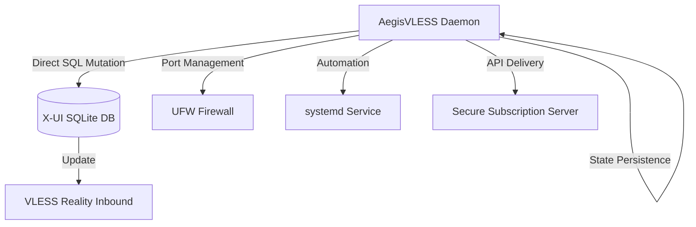

# AegisVLESS

<p align="center">
  
  
  
  
</p>

```text
    ___     ______   _______  _____  ______
   /   |   / ____/  / ____/  / ___/ / ____/
  / /| |  / __/    / / __    \__ \ / __/   
 / ___ | / /___   / /_/ /   ___/ // /___   
/_/  |_|/_____/   \____/   /____//_____/   
                                           
```

---

### 📖 Description / Описание

**EN:** A standalone Python daemon and CLI tool for automated management and dynamic rotation of VLESS Reality configurations in X-UI panels. It interacts directly with the SQLite database to ensure censorship resistance.
**RU:** Автономный Python-демон и CLI-утилита для автоматического управления и динамической ротации конфигураций VLESS Reality в панелях X-UI. Взаимодействует напрямую с БД SQLite для обеспечения обхода блокировок.

---

### 🛠 Architecture Flow / Архитектура



---

### 🚀 Key Features / Основные возможности

* **EN:** **Direct Database Mutation:** Modifies `/etc/x-ui/x-ui.db` directly for instant updates.
    **RU:** **Прямая модификация БД:** Работа с `/etc/x-ui/x-ui.db` напрямую для мгновенного обновления настроек.
* **EN:** **Dynamic Rotation:** Supports SNI rotation (best_ping/random) and Port shifting (standard/dynamic).
    **RU:** **Динамическая ротация:** Поддержка ротации SNI (ping/random) и смены портов (стандартные/динамические).
* **EN:** **Firewall Automation:** Automatically manages `ufw` rules during rotation cycles.
    **RU:** **Автоматизация фаервола:** Автоматическое управление правилами `ufw` при смене портов.
* **EN:** **Systemd Integration:** Runs as a background daemon with full logging support.
    **RU:** **Интеграция с systemd:** Работает как фоновый демон с полной поддержкой логов.
* **EN:** **Subscription Provisioning:** Built-in HTTP server for serving VLESS links via secure paths.
    **RU:** **Сервер подписок:** Встроенный HTTP-сервер для раздачи VLESS-ссылок по защищенным путям.

---

### 🛠 System Requirements / Системные требования

* **EN:** Linux distribution with `systemd` (Ubuntu 20.04+, Debian 11+).
    **RU:** Linux дистрибутив с `systemd` (Ubuntu 20.04+, Debian 11+).
* **EN:** Python 3.8+, `sqlite3`, `ufw`, `curl`, `git`.
    **RU:** Python 3.8+, `sqlite3`, `ufw`, `curl`, `git`.
* **EN:** Root privileges and an active X-UI panel installation.
    **RU:** Права root и установленная панель X-UI.

---

### 📦 Installation & Usage / Установка и использование

**1. Clone & Prepare / Клонирование и подготовка:**
```bash
git clone https://github.com/neeitr0n/AegisVLESS.git
cd AegisVLESS
chmod +x aegis.py
```

**2. Run Setup / Запуск настройки:**
```bash
sudo python3 aegis.py
```

**3. Service Control / Управление службой:**
```bash
sudo systemctl status aegis
sudo journalctl -u aegis -f
```

---

### 🔗 SNI Pool / Пул доменов

<details>
<summary>View configured domains / Посмотреть список доменов</summary>

- rutube.ru
- yandex.ru
- vk.com
- ozon.ru
- ya.ru
- wildberries.ru
- python.org
- microsoft.com
- apple.com
- samsung.com
- oracle.com
- pinterest.com
- kernel.org
- cisco.org
- nvidia.com
- amd.com
</details>

---

### ⚠️ Disclaimer
**EN:** This tool is for educational purposes only. The author is not responsible for any misuse.
**RU:** Этот инструмент предназначен только для образовательных целей. Автор не несет ответственности за любое нецелевое использование.
