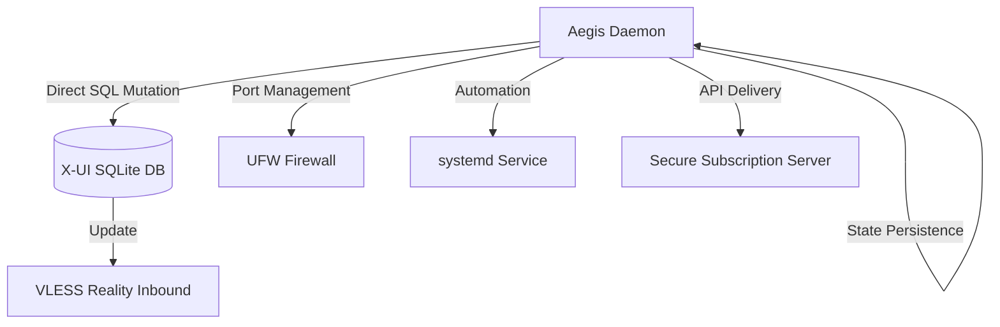

# Aegis Surgeon

<p align="center">
  
  
  
  
</p>

[English](#english) | [Русский](#русский)

---

<a name="english"></a>
## English

A standalone Python daemon and CLI tool designed for automated management and dynamic rotation of **VLESS Reality** configurations within X-UI panels. Aegis eliminates manual intervention by interacting directly with the SQLite database to ensure high availability and censorship resistance.

### 🛠 Architecture Flow



### 🚀 Key Features

- **Database-Level Integration:** Modifies `/etc/x-ui/x-ui.db` directly for zero-latency updates.
- **Intelligent SNI Rotation:** - `best_ping`: Automatic selection based on lowest latency.
  - `random_sni`: Randomized selection from a vetted pool.
- **Port Shifting:** Toggle between standard web ports (80, 443) and dynamic ephemeral ranges (42k-65k).
- **Self-Healing Firewall:** Automatic `ufw` rule updates synchronized with port rotation.
- **Stateless Configuration:** Zero external `.json` dependencies; state is maintained within the binary logic.

### 📦 Installation

```bash
git clone https://github.com/neeitr0n/AegisVLESS.git
cd AegisVLESS
chmod +x aegis_surgeon.py
```

### ⚙️ Usage

1. **Initial Setup:**
   ```bash
   sudo python3 aegis_surgeon.py
   ```
2. **Daemon Control:**
   ```bash
   sudo systemctl status aegis
   sudo journalctl -u aegis -f -n 50
   ```

---

<a name="русский"></a>
## Русский

Автономный Python-демон и CLI-утилита для автоматизированного управления и динамической ротации конфигураций **VLESS Reality** в панелях X-UI. Aegis исключает необходимость ручной настройки, взаимодействуя напрямую с базой данных SQLite для обеспечения максимальной скрытности и обхода блокировок.

### 🌟 Основные возможности

- **Прямая модификация БД:** Работа с `/etc/x-ui/x-ui.db` для мгновенного обновления настроек без перезапуска всей панели.
- **Умная ротация SNI:**
  - `best_ping`: Автоматический выбор домена с минимальной задержкой.
  - `random_sni`: Случайный выбор из пула проверенных доменов.
- **Гибкие порты:** Поддержка стандартных веб-портов (80, 443 и др.) или динамического диапазона (42000-65000).
- **Автоматизация UFW:** Синхронное открытие новых и закрытие старых портов в фаерволе.
- **Subscription Server:** Встроенный сервер для раздачи актуальных ссылок по защищенному пути.

### 📂 Структура проекта

```text
.
├── aegis_surgeon.py    # Основная логика и CLI меню
├── README.md           # Документация проекта
└── .gitignore          # Исключения Git
```

### 🛠 Системные требования

- **ОС:** Linux дистрибутивы с поддержкой `systemd` (Ubuntu 20.04+, Debian 11+).
- **Зависимости:** Python 3.8+, `sqlite3`, `ufw`, `curl`, `git`.
- **Права:** Требуется запуск от имени `root`.

### 🔗 Проверенный пул SNI

<details>
<summary>Нажмите, чтобы развернуть список доменов</summary>

- debian.org
- kernel.org
- python.org
- cloudflare.com
- microsoft.com
- wikipedia.org
- *и еще 55+ проверенных доменов с поддержкой TLS 1.3 и H2*
</details>

---

### ⚠️ Disclaimer
This tool is for educational purposes only. The author is not responsible for any misuse or damages caused by this software.
