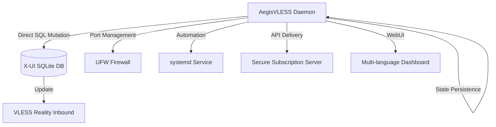
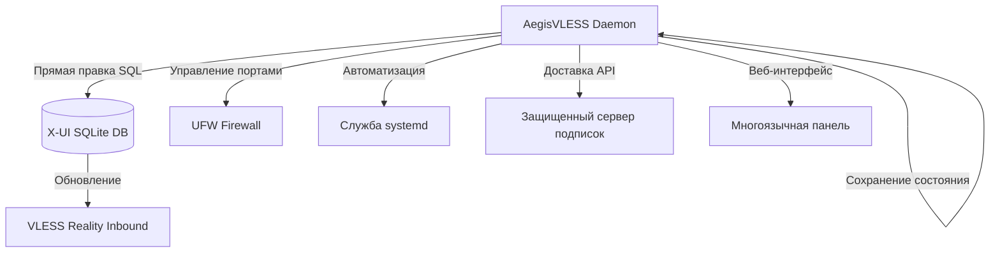
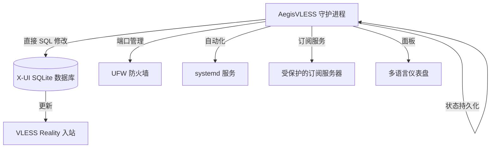
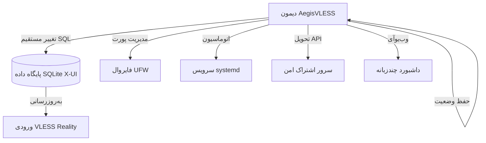

```markdown
# AegisVLESS
                                                                            
▄████▄ ▄▄▄▄▄  ▄▄▄▄ ▄▄  ▄▄▄▄   ██  ██ ██     ██████ ▄█████ ▄█████   
██▄▄██ ██▄▄  ██ ▄▄ ██ ███▄▄   ██▄▄██ ██     ██▄▄   ▀▀▀▄▄▄ ▀▀▀▄▄▄   
██  ██ ██▄▄▄ ▀███▀ ██ ▄▄██▀    ▀██▀  ██████ ██▄▄▄▄ █████▀ █████▀                                                      
                                           
```

<p align="center">
  
  
  
  
</p>

> <b>Was this tool helpful? Give it a ⭐ as a "thank you"!</b><br>
> <b>Инструмент был полезен? Поставь ⭐ в качестве «спасибо»!</b><br>
> <b>这个工具对您有帮助吗？请给它点个赞⭐以示感谢！</b><br>
> <b>آیا این ابزار مفید بود؟ به عنوان تشکر، یک ⭐ به آن بدهید!</b><br>
[English](#english) | [Русский](#русский) | [简体中文](#简体中文) | [فارسى](#فارسى)

---

<a name="english"></a>
## English

A standalone Python daemon for **automated management and dynamic rotation** of **VLESS Reality** configurations within X-UI panels. Aegis eliminates manual intervention by interacting directly with the SQLite database to ensure high availability and censorship resistance through seamless configuration updates.

### 🛠 Architecture Flow

```mermaid
graph TD
    A[AegisVLESS Daemon] -->|Direct SQL Mutation| B[(X-UI SQLite DB)]
    A -->|State Persistence| A
    A -->|Port Management| C[UFW Firewall]
    A -->|Automation| D[systemd Service]
    A -->|API Delivery| E[Secure Subscription Server]
    A -->|WebUI| F[Multi-language Dashboard]
    B -->|Update| G[VLESS Reality Inbound]
```

### 🚀 Key Features
- **Database-Level Integration:** Modifies `/etc/x-ui/x-ui.db` directly for zero-latency updates without panel restarts.
- **Intelligent SNI Rotation:**
  - `best_ping`: Automatic selection based on lowest latency (measures real-time response)
  - `random_sni`: Randomized selection from a vetted pool of 14+ domains
- **Port Shifting:**
  - `dynamic`: Random ports in ephemeral range (49152-65535)
  - `standard`: Common web ports (80, 443, 2053, 8443, etc.)
- **Seamless Migration:** Creates temporary inbound, waits for client migration (40 min), then swaps configurations
- **Self-Healing Firewall:** Automatic `ufw` rule updates synchronized with port rotation
- **Secure Subscription Server:** Built-in delivery via customizable encrypted paths
- **Multi-language WebUI:** Dashboard with EN/RU/ZH/FA support and light/dark themes
- **Zero External Configs:** All state maintained within runtime (no `.json` dependencies)

### 📂 Project Structure
```text
.
├── aegis.py            # Core logic, CLI menu & daemon
├── gui/                # Web interface assets
│   ├── index_template.html  # Dynamic HTML template
│   ├── index_data.html      # Auto-generated dashboard
│   └── login.html           # Authentication interface
├── README.md           # Project documentation
└── .gitignore          # Git exclusions
```

### 🛠 System Requirements
- **OS:** Linux distributions with `systemd` (Ubuntu 20.04+, Debian 11+)
- **Dependencies:** Python 3.8+, `sqlite3`, `ufw`, `curl`, `git`
- **Permissions:** Must be run as `root` (required for DB access and firewall control)

### 📦 Installation & Usage
1. **Clone & Prepare:**
   ```bash
   git clone https://github.com/neeitr0n/AegisVLESS.git
   cd AegisVLESS
   chmod +x aegis.py
   ```
2. **Initial Setup (Interactive):**
   ```bash
   sudo python3 aegis.py
   ```
   *Guided setup will configure:*
   - Target X-UI inbound remark
   - SNI/port rotation strategy
   - Secure subscription path
   - WebUI credentials (optional)
3. **Service Management:**
   ```bash
   sudo systemctl status aegis       # Check service status
   sudo journalctl -u aegis -f       # View live logs
   sudo python3 aegis.py -menu       # Access configuration menu
   ```

---

<a name="русский"></a>
## Русский

Автономный Python-демон для **автоматизированного управления и динамической ротации** конфигураций **VLESS Reality** в панелях X-UI. Aegis исключает ручное вмешательство, взаимодействуя напрямую с базой данных SQLite для обеспечения максимальной доступности и устойчивости к блокировкам через бесшовные обновления конфигурации.

### 🛠 Схема работы

```mermaid
graph TD
    A[AegisVLESS Daemon] -->|Прямая правка SQL| B[(X-UI SQLite DB)]
    A -->|Сохранение состояния| A
    A -->|Управление портами| C[UFW Firewall]
    A -->|Автоматизация| D[Служба systemd]
    A -->|Доставка API| E[Защищенный сервер подписок]
    A -->|Веб-интерфейс| F[Многоязычная панель]
    B -->|Обновление| G[VLESS Reality Inbound]
```

### 🌟 Основные возможности
- **Прямая модификация БД:** Работа с `/etc/x-ui/x-ui.db` без перезапуска панели
- **Умная ротация SNI:**
  - `best_ping`: Автоматический выбор домена с минимальной задержкой (измерение в реальном времени)
  - `random_sni`: Случайный выбор из пула из 14+ проверенных доменов
- **Гибкие порты:**
  - `dynamic`: Случайные порты в диапазоне (49152-65535)
  - `standard`: Распространенные веб-порты (80, 443, 2053, 8443 и др.)
- **Бесшовная миграция:** Создание временного inbound, ожидание миграции клиентов (40 мин), замена конфигурации
- **Автоматизация UFW:** Синхронное открытие новых и закрытие старых портов
- **Защищенный сервер подписок:** Встроенная доставка через настраиваемые защищенные пути
- **Многоязычная WebUI:** Панель управления с поддержкой EN/RU/ZH/FA и светлой/темной тем
- **Автономность:** Все состояние хранится в runtime (без внешних `.json` конфигов)

### 📂 Структура проекта
```text
.
├── aegis.py            # Основная логика, CLI меню и демон
├── gui/                # Файлы веб-интерфейса
│   ├── index_template.html  # Шаблон динамической HTML
│   ├── index_data.html      # Автогенерируемая панель
│   └── login.html           # Страница аутентификации
├── README.md           # Документация проекта
└── .gitignore          # Исключения Git
```

### 🛠 Системные требования
- **ОС:** Linux дистрибутивы с поддержкой `systemd` (Ubuntu 20.04+, Debian 11+)
- **Зависимости:** Python 3.8+, `sqlite3`, `ufw`, `curl`, `git`
- **Права:** Требуется запуск от имени `root` (для доступа к БД и управлению фаерволом)

### 📦 Установка и использование
1. **Клонирование:**
   ```bash
   git clone https://github.com/neeitr0n/AegisVLESS.git
   cd AegisVLESS
   chmod +x aegis.py
   ```
2. **Первоначальная настройка (интерактивная):**
   ```bash
   sudo python3 aegis.py
   ```
   *Будут настроены:*
   - Целевой inbound в X-UI
   - Стратегия ротации SNI/портов
   - Защищенный путь подписки
   - Учетные данные WebUI (опционально)
3. **Управление службой:**
   ```bash
   sudo systemctl status aegis       # Проверка статуса
   sudo journalctl -u aegis -f       # Просмотр логов в реальном времени
   sudo python3 aegis.py -menu       # Доступ к меню настройки
   ```

---

<a name="简体中文"></a>
## 简体中文

独立 Python 守护进程，用于在 X-UI 面板中对 **VLESS Reality** 配置进行自动化管理和动态轮换。Aegis 通过直接操作 SQLite 数据库实现高可用性与对审查的抵抗能力，实现无须手动干预的平滑配置更新。

### 🛠 架构流程

```mermaid
graph TD
    A[AegisVLESS 守护进程] -->|直接 SQL 修改| B[(X-UI SQLite 数据库)]
    A -->|状态持久化| A
    A -->|端口管理| C[UFW 防火墙]
    A -->|自动化| D[systemd 服务]
    A -->|订阅服务| E[受保护的订阅服务器]
    A -->|面板| F[多语言仪表盘]
    B -->|更新| G[VLESS Reality 入站]
```

### 🌟 主要功能
- **数据库直接修改:** 直接修改 `/etc/x-ui/x-ui.db`，实现零延迟更新
- **智能 SNI 轮换:**
  - `best_ping`: 基于最低延迟自动选择 (实时测量)
  - `random_sni`: 从验证过的 14+ 域名池中随机选择
- **端口切换:**
  - `dynamic`: 临时端口范围 (49152-65535) 中的随机端口
  - `standard`: 常用 Web 端口 (80, 443, 2053, 8443 等)
- **无缝迁移:** 创建临时入站，等待客户端迁移 (40 分钟)，然后交换配置
- **自愈防火墙:** 与端口轮换同步自动更新 `ufw` 规则
- **安全订阅服务器:** 通过可定制加密路径内置交付
- **多语言 WebUI:** 仪表盘支持 EN/RU/ZH/FA 语言和亮/暗主题
- **无外部配置:** 所有状态都在运行时维护 (无 `.json` 依赖)

### 📂 项目结构
```text
.
├── aegis.py            # 核心逻辑、CLI 菜单与守护进程
├── gui/                # 网页界面资源
│   ├── index_template.html  # 动态 HTML 模板
│   ├── index_data.html      # 自动生成的仪表盘
│   └── login.html           # 认证界面
├── README.md           # 项目文档
└── .gitignore          # Git 忽略文件
```

### 🛠 系统要求
- **操作系统:** 支持 `systemd` 的 Linux 发行版 (Ubuntu 20.04+, Debian 11+)
- **依赖:** Python 3.8+, `sqlite3`, `ufw`, `curl`, `git`
- **权限:** 必须以 `root` 身份运行 (需要访问数据库和防火墙控制)

### 📦 安装与使用
1. **克隆与准备:**
   ```bash
   git clone https://github.com/neeitr0n/AegisVLESS.git
   cd AegisVLESS
   chmod +x aegis.py
   ```
2. **初始设置 (交互式):**
   ```bash
   sudo python3 aegis.py
   ```
   *引导设置将配置:*
   - 目标 X-UI 入站备注
   - SNI/端口轮换策略
   - 安全订阅路径
   - WebUI 凭据 (可选)
3. **服务管理:**
   ```bash
   sudo systemctl status aegis       # 检查服务状态
   sudo journalctl -u aegis -f       # 查看实时日志
   sudo python3 aegis.py -menu       # 访问配置菜单
   ```

---

<a name="فارسى"></a>
## فارسى

یک سرویس مستقل پایتون برای **مدیریت خودکار و چرخش پویا** پیکربندی‌های **VLESS Reality** در پنل‌های X-UI. ایجیس با تعامل مستقیم با پایگاه داده SQLite، دستکاری دستی را حذف کرده و از طریق به‌روزرسانی‌های بی‌درنگ، دسترسی بالا و مقاومت در برابر سانسور را تضمین می‌کند.

### 🛠 فرآیند معماری

```mermaid
graph TD
    A[دیمون AegisVLESS] -->|تغییر مستقیم SQL| B[(پایگاه داده SQLite X-UI)]
    A -->|حفظ وضعیت| A
    A -->|مدیریت پورت| C[فایروال UFW]
    A -->|اتوماسیون| D[سرویس systemd]
    A -->|تحویل API| E[سرور اشتراک امن]
    A -->|وب‌یوآی| F[داشبورد چندزبانه]
    B -->|به‌روزرسانی| G[ورودی VLESS Reality]
```

### 🌟 ویژگی‌های کلیدی
- **یکپارچه‌سازی سطح پایگاه داده:** تغییر مستقیم `/etc/x-ui/x-ui.db` برای به‌روزرسانی‌های بدون تأخیر بدون نیاز به راه‌اندازی مجدد پنل
- **چرخش هوشمند SNI:**
  - `best_ping`: انتخاب خودکار بر اساس کمترین تأخیر (اندازه‌گیری لحظه‌ای)
  - `random_sni`: انتخاب تصادفی از یک مجموعه 14+ دامنه تأیید شده
- **تغییر پورت:**
  - `dynamic`: پورت‌های تصادفی در محدوده گذرا (49152-65535)
  - `standard`: پورت‌های وب رایج (80, 443, 2053, 8443 و غیره)
- **مهاجرت بی‌درنگ:** ایجاد ورودی موقت، انتظار برای مهاجرت کلاینت‌ها (40 دقیقه)، سپس جایگزینی پیکربندی
- **فایروال خودتعمیرکننده:** به‌روزرسانی خودکار قوانین `ufw` همگام با چرخش پورت
- **سرور اشتراک امن:** تحویل داخلی از طریق مسیرهای رمزنگاری‌شده قابل تنظیم
- **وب‌یوآی چندزبانه:** داشبورد با پشتیبانی EN/RU/ZH/FA و تم‌های روشن/تیره
- **بدون پیکربندی خارجی:** تمام وضعیت درون منطق اجرا حفظ می‌شود (بدون وابستگی به `.json`)

### 📂 ساختار پروژه
```text
.
├── aegis.py            # منطق اصلی، منوی CLI و دیمون
├── gui/                # دارایی‌های رابط وب
│   ├── index_template.html  # الگوی HTML پویا
│   ├── index_data.html      # داشبورد خودتولیدی
│   └── login.html           # رابط احراز هویت
├── README.md           # مستندات پروژه
└── .gitignore          # رد کردن فایل‌ها در Git
```

### 🛠 نیازمندی‌های سیستم
- **سیستم عامل:** توزیع‌های لینوکس با `systemd` (اوبونتو 20.04+, دبیان 11+)
- **وابستگی‌ها:** پایتون 3.8+, `sqlite3`, `ufw`, `curl`, `git`
- **مجوزها:** باید به عنوان `root` اجرا شود (برای دسترسی به پایگاه داده و کنترل فایروال)

### 📦 نصب و استفاده
1. **کلون و آماده‌سازی:**
   ```bash
   git clone https://github.com/neeitr0n/AegisVLESS.git
   cd AegisVLESS
   chmod +x aegis.py
   ```
2. **تنظیمات اولیه (تعاملی):**
   ```bash
   sudo python3 aegis.py
   ```
   *تنظیمات راهنما شامل:*
   - نام ورودی هدف X-UI
   - استراتژی چرخش SNI/پورت
   - مسیر امن اشتراک
   - اعتبارنامه‌های وب‌یوآی (اختیاری)
3. **مدیریت سرویس:**
   ```bash
   sudo systemctl status aegis       # بررسی وضعیت سرویس
   sudo journalctl -u aegis -f       # مشاهده لاگ‌های زنده
   sudo python3 aegis.py -menu       # دسترسی به منوی پیکربندی
   ```

---

### 🔗 SNI Pool / Список SNI-доменов / SNI域名列表 / پول دامنه‌ها
<details>
<summary>View configured domains / Посмотреть список доменов / 查看域名列表 / مشاهده دامنه‌های پیکربندی شده</summary>

- rutube.ru
- yandex.ru
- ya.ru
- www.python.org
- www.microsoft.com
- www.apple.com
- www.samsung.com
- www.oracle.com
- www.pinterest.com
- www.kernel.org
- www.cisco.org
- www.nvidia.com
- www.amd.com
</details>

---

### ⚠️ Disclaimer / اخطار
This tool is for educational purposes only. The author is not responsible for any misuse or damages caused by this software.  
این ابزار صرفاً برای اهداف آموزشی است. نویسنده مسئول هرگونه سوء استفاده یا خسارتی که از این نرم‌افزار حاصل شود
