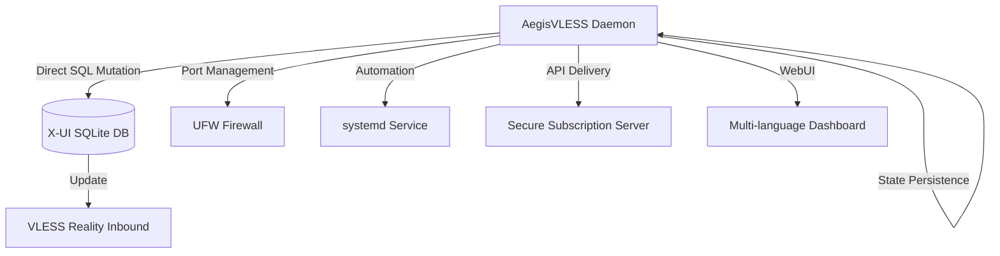

<a name="english"></a>
## English

A standalone Python daemon for **automated management and dynamic rotation** of **VLESS Reality** configurations within X-UI panels. Aegis eliminates manual intervention by interacting directly with the SQLite database to ensure high availability and censorship resistance through seamless configuration updates.

### 🛠 Architecture Flow


### 🚀 Key Features
- **Database-Level Integration:** Modifies `/etc/x-ui/x-ui.db` directly for zero-latency updates without panel restarts.
- **Intelligent SNI Rotation:**
  - `best_ping`: Automatic selection based on lowest latency (measures real-time response)
  - `random_sni`: Randomized selection from a vetted pool of 14+ domains
- **Port Shifting:**
  - `dynamic`: Random ports in ephemeral range (49152-65535)
  - `standard`: Common web ports (80, 443, 2053, 8443, etc.)
- **Seamless Migration:** Creates temporary inbound, waits for client migration (40 min), then swaps configurations
- **Self-Healing Firewall:** Automatic `ufw` rule updates synchronized with port rotation
- **Secure Subscription Server:** Built-in delivery via customizable encrypted paths
- **Multi-language WebUI:** Dashboard with EN/RU/ZH/FA support and light/dark themes
- **Zero External Configs:** All state maintained within runtime (no `.json` dependencies)

### 📂 Project Structure
```text
.
├── aegis.py            # Core logic, CLI menu & daemon
├── gui/                # Web interface assets
│   ├── index_template.html  # Dynamic HTML template
│   ├── index_data.html      # Auto-generated dashboard
│   └── login.html           # Authentication interface
├── README.md           # Project documentation
└── .gitignore          # Git exclusions
```

### 🛠 System Requirements
- **OS:** Linux distributions with `systemd` (Ubuntu 20.04+, Debian 11+)
- **Dependencies:** Python 3.8+, `sqlite3`, `ufw`, `curl`, `git`
- **Permissions:** Must be run as `root` (required for DB access and firewall control)

### 📦 Installation & Usage
1. **Clone & Prepare:**
   ```bash
   git clone https://github.com/neeitr0n/AegisVLESS.git
   cd AegisVLESS
   chmod +x aegis.py
   ```
2. **Initial Setup (Interactive):**
   ```bash
   sudo python3 aegis.py
   ```
   *Guided setup will configure:*
   - Target X-UI inbound remark
   - SNI/port rotation strategy
   - Secure subscription path
   - WebUI credentials (optional)
3. **Service Management:**
   ```bash
   sudo systemctl status aegis       # Check service status
   sudo journalctl -u aegis -f       # View live logs
   sudo python3 aegis.py -menu       # Access configuration menu
   ```

   > <b>Was this tool helpful? Give it a ⭐ as a "thank you"!</b><br>
   
