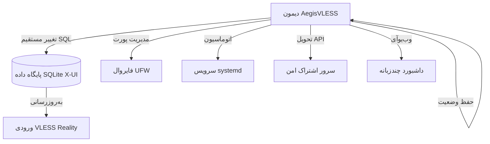

<a name="فارسى"></a>
## فارسى

یک سرویس مستقل پایتون برای **مدیریت خودکار و چرخش پویا** پیکربندی‌های **VLESS Reality** در پنل‌های X-UI. ایجیس با تعامل مستقیم با پایگاه داده SQLite، دستکاری دستی را حذف کرده و از طریق به‌روزرسانی‌های بی‌درنگ، دسترسی بالا و مقاومت در برابر سانسور را تضمین می‌کند.

### 🛠 فرآیند معماری


### 🌟 ویژگی‌های کلیدی
- **یکپارچه‌سازی سطح پایگاه داده:** تغییر مستقیم `/etc/x-ui/x-ui.db` برای به‌روزرسانی‌های بدون تأخیر بدون نیاز به راه‌اندازی مجدد پنل
- **چرخش هوشمند SNI:**
  - `best_ping`: انتخاب خودکار بر اساس کمترین تأخیر (اندازه‌گیری لحظه‌ای)
  - `random_sni`: انتخاب تصادفی از یک مجموعه 14+ دامنه تأیید شده
- **تغییر پورت:**
  - `dynamic`: پورت‌های تصادفی در محدوده گذرا (49152-65535)
  - `standard`: پورت‌های وب رایج (80, 443, 2053, 8443 و غیره)
- **مهاجرت بی‌درنگ:** ایجاد ورودی موقت، انتظار برای مهاجرت کلاینت‌ها (40 دقیقه)، سپس جایگزینی پیکربندی
- **فایروال خودتعمیرکننده:** به‌روزرسانی خودکار قوانین `ufw` همگام با چرخش پورت
- **سرور اشتراک امن:** تحویل داخلی از طریق مسیرهای رمزنگاری‌شده قابل تنظیم
- **وب‌یوآی چندزبانه:** داشبورد با پشتیبانی EN/RU/ZH/FA و تم‌های روشن/تیره
- **بدون پیکربندی خارجی:** تمام وضعیت درون منطق اجرا حفظ می‌شود (بدون وابستگی به `.json`)

### 📂 ساختار پروژه
```text
.
├── aegis.py            # منطق اصلی، منوی CLI و دیمون
├── gui/                # دارایی‌های رابط وب
│   ├── index_template.html  # الگوی HTML پویا
│   ├── index_data.html      # داشبورد خودتولیدی
│   └── login.html           # رابط احراز هویت
├── README.md           # مستندات پروژه
└── .gitignore          # رد کردن فایل‌ها در Git
```

### 🛠 نیازمندی‌های سیستم
- **سیستم عامل:** توزیع‌های لینوکس با `systemd` (اوبونتو 20.04+, دبیان 11+)
- **وابستگی‌ها:** پایتون 3.8+, `sqlite3`, `ufw`, `curl`, `git`
- **مجوزها:** باید به عنوان `root` اجرا شود (برای دسترسی به پایگاه داده و کنترل فایروال)

### 📦 نصب و استفاده
1. **کلون و آماده‌سازی:**
   ```bash
   git clone https://github.com/neeitr0n/AegisVLESS.git
   cd AegisVLESS
   chmod +x aegis.py
   ```
2. **تنظیمات اولیه (تعاملی):**
   ```bash
   sudo python3 aegis.py
   ```
   *تنظیمات راهنما شامل:*
   - نام ورودی هدف X-UI
   - استراتژی چرخش SNI/پورت
   - مسیر امن اشتراک
   - اعتبارنامه‌های وب‌یوآی (اختیاری)
3. **مدیریت سرویس:**
   ```bash
   sudo systemctl status aegis       # بررسی وضعیت سرویس
   sudo journalctl -u aegis -f       # مشاهده لاگ‌های زنده
   sudo python3 aegis.py -menu       # دسترسی به منوی پیکربندی
   ```

   > <b>آیا این ابزار مفید بود؟ به عنوان تشکر، یک ⭐ به آن بدهید!</b><br>
   
