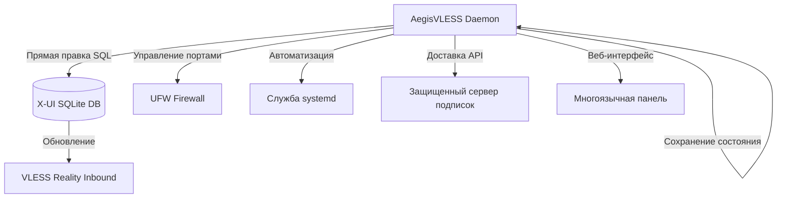

<a name="русский"></a>
## Русский

Автономный Python-демон для **автоматизированного управления и динамической ротации** конфигураций **VLESS Reality** в панелях X-UI. Aegis исключает ручное вмешательство, взаимодействуя напрямую с базой данных SQLite для обеспечения максимальной доступности и устойчивости к блокировкам через бесшовные обновления конфигурации.

### 🛠 Схема работы


### 🌟 Основные возможности
- **Прямая модификация БД:** Работа с `/etc/x-ui/x-ui.db` без перезапуска панели
- **Умная ротация SNI:**
  - `best_ping`: Автоматический выбор домена с минимальной задержкой (измерение в реальном времени)
  - `random_sni`: Случайный выбор из пула из 14+ проверенных доменов
- **Гибкие порты:**
  - `dynamic`: Случайные порты в диапазоне (49152-65535)
  - `standard`: Распространенные веб-порты (80, 443, 2053, 8443 и др.)
- **Бесшовная миграция:** Создание временного inbound, ожидание миграции клиентов (40 мин), замена конфигурации
- **Автоматизация UFW:** Синхронное открытие новых и закрытие старых портов
- **Защищенный сервер подписок:** Встроенная доставка через настраиваемые защищенные пути
- **Многоязычная WebUI:** Панель управления с поддержкой EN/RU/ZH/FA и светлой/темной тем
- **Автономность:** Все состояние хранится в runtime (без внешних `.json` конфигов)

### 📂 Структура проекта
```text
.
├── aegis.py            # Основная логика, CLI меню и демон
├── gui/                # Файлы веб-интерфейса
│   ├── index_template.html  # Шаблон динамической HTML
│   ├── index_data.html      # Автогенерируемая панель
│   └── login.html           # Страница аутентификации
├── README.md           # Документация проекта
└── .gitignore          # Исключения Git
```

### 🛠 Системные требования
- **ОС:** Linux дистрибутивы с поддержкой `systemd` (Ubuntu 20.04+, Debian 11+)
- **Зависимости:** Python 3.8+, `sqlite3`, `ufw`, `curl`, `git`
- **Права:** Требуется запуск от имени `root` (для доступа к БД и управлению фаерволом)

### 📦 Установка и использование
1. **Клонирование:**
   ```bash
   git clone https://github.com/neeitr0n/AegisVLESS.git
   cd AegisVLESS
   chmod +x aegis.py
   ```
2. **Первоначальная настройка (интерактивная):**
   ```bash
   sudo python3 aegis.py
   ```
   *Будут настроены:*
   - Целевой inbound в X-UI
   - Стратегия ротации SNI/портов
   - Защищенный путь подписки
   - Учетные данные WebUI (опционально)
3. **Управление службой:**
   ```bash
   sudo systemctl status aegis       # Проверка статуса
   sudo journalctl -u aegis -f       # Просмотр логов в реальном времени
   sudo python3 aegis.py -menu       # Доступ к меню настройки
   ```
   
> <b>Инструмент был полезен? Поставь ⭐ в качестве «спасибо»!</b><br>
   
