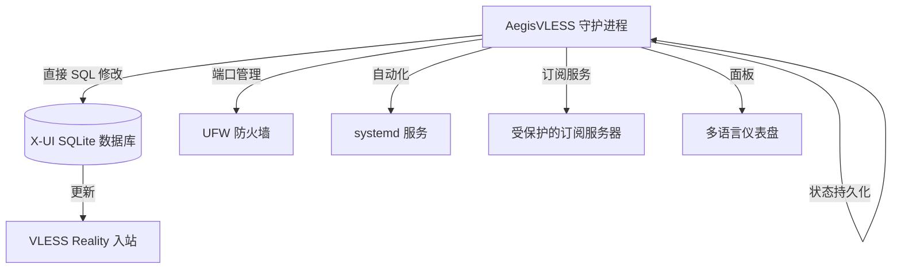

<a name="简体中文"></a>
## 简体中文

独立 Python 守护进程，用于在 X-UI 面板中对 **VLESS Reality** 配置进行自动化管理和动态轮换。Aegis 通过直接操作 SQLite 数据库实现高可用性与对审查的抵抗能力，实现无须手动干预的平滑配置更新。

### 🛠 架构流程


### 🌟 主要功能
- **数据库直接修改:** 直接修改 `/etc/x-ui/x-ui.db`，实现零延迟更新
- **智能 SNI 轮换:**
  - `best_ping`: 基于最低延迟自动选择 (实时测量)
  - `random_sni`: 从验证过的 14+ 域名池中随机选择
- **端口切换:**
  - `dynamic`: 临时端口范围 (49152-65535) 中的随机端口
  - `standard`: 常用 Web 端口 (80, 443, 2053, 8443 等)
- **无缝迁移:** 创建临时入站，等待客户端迁移 (40 分钟)，然后交换配置
- **自愈防火墙:** 与端口轮换同步自动更新 `ufw` 规则
- **安全订阅服务器:** 通过可定制加密路径内置交付
- **多语言 WebUI:** 仪表盘支持 EN/RU/ZH/FA 语言和亮/暗主题
- **无外部配置:** 所有状态都在运行时维护 (无 `.json` 依赖)

### 📂 项目结构
```text
.
├── aegis.py            # 核心逻辑、CLI 菜单与守护进程
├── gui/                # 网页界面资源
│   ├── index_template.html  # 动态 HTML 模板
│   ├── index_data.html      # 自动生成的仪表盘
│   └── login.html           # 认证界面
├── README.md           # 项目文档
└── .gitignore          # Git 忽略文件
```

### 🛠 系统要求
- **操作系统:** 支持 `systemd` 的 Linux 发行版 (Ubuntu 20.04+, Debian 11+)
- **依赖:** Python 3.8+, `sqlite3`, `ufw`, `curl`, `git`
- **权限:** 必须以 `root` 身份运行 (需要访问数据库和防火墙控制)

### 📦 安装与使用
1. **克隆与准备:**
   ```bash
   git clone https://github.com/neeitr0n/AegisVLESS.git
   cd AegisVLESS
   chmod +x aegis.py
   ```
2. **初始设置 (交互式):**
   ```bash
   sudo python3 aegis.py
   ```
   *引导设置将配置:*
   - 目标 X-UI 入站备注
   - SNI/端口轮换策略
   - 安全订阅路径
   - WebUI 凭据 (可选)
3. **服务管理:**
   ```bash
   sudo systemctl status aegis       # 检查服务状态
   sudo journalctl -u aegis -f       # 查看实时日志
   sudo python3 aegis.py -menu       # 访问配置菜单
   ```

   > <b>这个工具对您有帮助吗？请给它点个赞⭐以示感谢！</b><br>
